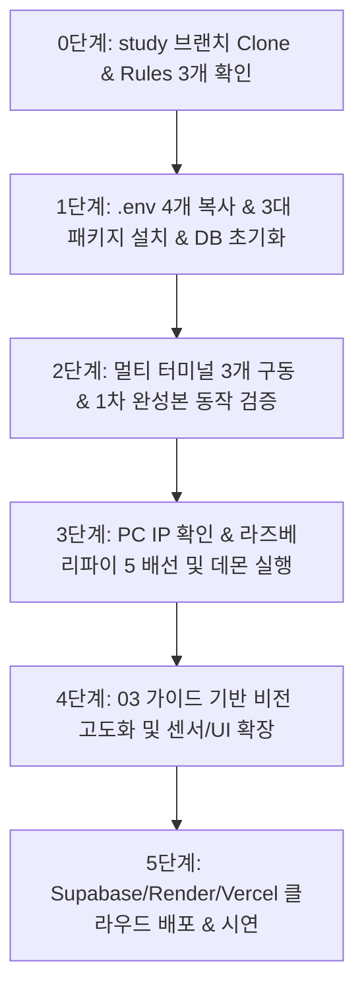

# 02. 학생 수작업 로드맵 (체크리스트)

> 📂 **본편 02 / 팀 전원 / 수업 중 진행 체크용** · 상세 설치/실행 방법은 [01-학생용-설치-및-사용-매뉴얼](01-학생용-설치-및-사용-매뉴얼.md) · AI 확장 프롬프트는 [03-2차-개발을-위한-AI-연동-및-확장-가이드](03-2차-개발을-위한-AI-연동-및-확장-가이드.md) · 전체 목록 [docs/README.md](README.md)

> AI에게 프롬프트로 시키지 않고 **학생이 직접 터미널/GUI/브라우저로 실행해야 하는 작업만** 모은 체크리스트입니다.



---

## 0단계. 저장소 받기 (Clone) & Antigravity 세팅

- [ ] 저장소 클론:
  ```powershell
  git clone -b study https://github.com/foxjini/agent-vibe-coding-starter-kit2.git agent-vibe-coding-starter-kit2-study
  cd agent-vibe-coding-starter-kit2-study
  ```
- [ ] Antigravity IDE에서 해당 폴더를 워크스페이스로 열기
- [ ] 우측 상단 `…` ➔ **Customizations** ➔ **Rules**에서 **3개만 Always On** 확인:
  - `karpathy-principles`
  - `security-rules`
  - `coding-standards`
  *(불필요한 토큰 낭비를 막기 위해 나머지 규칙은 끄기)*

---

## 1단계. 환경변수 준비 & 패키지 설치 & DB 초기화

- [ ] `.env.example` ➔ `.env` 4개 복사:
  ```powershell
  copy backend\.env.example backend\.env
  copy frontend\.env.example frontend\.env
  copy vision\.env.example vision\.env
  copy pi\.env.example pi\.env
  ```
- [ ] `backend/.env`, `vision/.env`, `pi/.env` 3개 파일의 `DEVICE_API_KEY` 값이 서로 동일한지 확인
- [ ] **백엔드 venv 생성 및 패키지 설치**:
  ```powershell
  cd backend
  py -3.12 -m venv venv
  .\venv\Scripts\Activate.ps1
  pip install -r requirements.txt
  cd ..
  ```
- [ ] **프론트엔드 패키지 설치** (⚠️ `create-next-app` 절대 실행 금지):
  ```powershell
  cd frontend
  npm install
  cd ..
  ```
- [ ] **비전 패키지 설치** (초경량 ONNX 기반, Python 3.12 권장):
  ```powershell
  cd vision
  py -3.12 -m venv venv
  .\venv\Scripts\Activate.ps1
  pip install -r requirements.txt
  cd ..
  ```
- [ ] **로컬 DB 초기화**:
  - XAMPP 실행 ➔ Apache & MySQL **Start**
  - DB 초기화 실행:
    ```powershell
    cd backend
    Get-Content db\init.sql | mysql -u root
    cd ..
    ```
    *(phpMyAdmin 웹 화면 `http://localhost/phpmyadmin`의 SQL 탭에서 붙여넣어 실행해도 무방)*

---

## 2단계. 1차 완성본 로컬 구동 & 통합 검증 (터미널 3개 동시 유지)

- [ ] **[터미널 1] 백엔드 서버 실행**:
  ```powershell
  cd backend
  .\venv\Scripts\Activate.ps1
  uvicorn main:app --reload --port 8000
  ```
  - 브라우저 `http://localhost:8000/docs` 및 `/health` 정상 응답 확인
- [ ] **[터미널 2] 새 터미널 ➔ 프론트엔드 대시보드 실행**:
  ```powershell
  cd frontend
  npm run dev
  ```
  - 브라우저 `http://localhost:3000` 접속 ➔ 상단 "● 실시간 연결됨" (녹색 배지) 확인
  - 조명 밝기 슬라이더 및 진동 모터 토글 버튼 클릭 동작 확인
- [ ] **[터미널 3] 새 터미널 ➔ 비전 클라이언트 실행**:
  ```powershell
  cd vision
  .\venv\Scripts\Activate.ps1
  python main.py
  ```
  - 웹캠 창이 뜨면 창을 클릭한 뒤 키보드 시뮬레이션 테스트:
    - [ ] `1`번 키: 착석 토글 ➔ 대시보드 공부 타이머 작동 및 조명 ON
    - [ ] `2`번 키: 졸음 감지 토글 ➔ 대시보드 빨간색 펄스 경보 & 방석 진동 모터 가동
    - [ ] `3`번 키: 거북목 감지 토글 ➔ 대시보드 노란색 펄스 경보 & 등받이 진동 모터 가동
    - [ ] `0`번 키: 정상 상태로 복귀
  - 대시보드 "퇴실 및 학습 완료" 버튼 클릭 ➔ 세션 리포트 및 스마트폰 스캔용 QR 코드 모달 확인

---

## 3단계 (2차 개발 1). 라즈베리파이 5 실제 하드웨어 연동

- [ ] Windows PC의 IP 확인:
  ```powershell
  ipconfig
  # IPv4 주소 확인 (예: 192.168.0.25)
  ```
- [ ] 라즈베리파이의 `pi/.env` 파일 열기 ➔ `BACKEND_URL`을 PC IP로 수정 (`http://192.168.0.25:8000`)
- [ ] 라즈베리파이 핀 배선 (LED 바, 등받이 진동 모터, 방석 진동 모터, 릴레이)
  *(반드시 **전원을 끈 상태**에서 교사 입회 하에 배선 진행 — [부록B](부록B-라즈베리파이5-담당자-온보딩-슬라이드.pptx) 참고)*
- [ ] 라즈베리파이 5 터미널에서 데몬 패키지 설치 및 실행:
  *(주의: Pi 5 RP1 칩셋 환경에서는 pip 빌드 오류 방지를 위해 시스템 패키지 설치 및 `--system-site-packages` 필수)*
  ```bash
  cd pi
  sudo apt update
  sudo apt install -y python3-gpiozero python3-lgpio
  python3 -m venv --system-site-packages venv
  source venv/bin/activate
  pip install requests python-dotenv
  python 01_ping_backend.py        # 1단계 통신 확인
  python 02_seat_daemon_mock.py    # 2단계 Mock 데몬 확인
  # python main.py                 # 3단계 실기기 제어 데몬 (작성 후)
  ```
- [ ] `backend/.env`에서 `DEVICE_MODE=hardware`로 변경 후 백엔드 재시작
- [ ] 대시보드 조작 및 비전 이벤트 발생 시 실제 하드웨어(LED/진동 모터) 반응 확인

---

## 4단계 (2차 개발 2). 기능 확장 및 고도화

- [ ] [03-2차-개발을-위한-AI-연동-및-확장-가이드](03-2차-개발을-위한-AI-연동-및-확장-가이드.md)의 템플릿 B를 활용해 신규 센서/액추에이터 추가
- [ ] 비전 감지 로직 임계치 튜닝 및 추가 자세 판별 알고리즘 구현
- [ ] `.agents/workflows/health-check.md` 워크플로우로 전체 시스템 정합성 점검

---

## 5단계 (2차 개발 3). 클라우드 배포

- [ ] Supabase 프로젝트 생성 및 마이그레이션 DDL 적용 ([03 가이드](03-2차-개발을-위한-AI-연동-및-확장-가이드.md) 7-1절)
- [ ] Render에 FastAPI 백엔드 배포 및 환경변수 등록 ([03 가이드](03-2차-개발을-위한-AI-연동-및-확장-가이드.md) 7-2절)
- [ ] Vercel에 Next.js 프론트엔드 배포 ([03 가이드](03-2차-개발을-위한-AI-연동-및-확장-가이드.md) 7-3절)
- [ ] 외부 스마트폰으로 대시보드 접속 및 QR 코드 스캔 최종 시연
