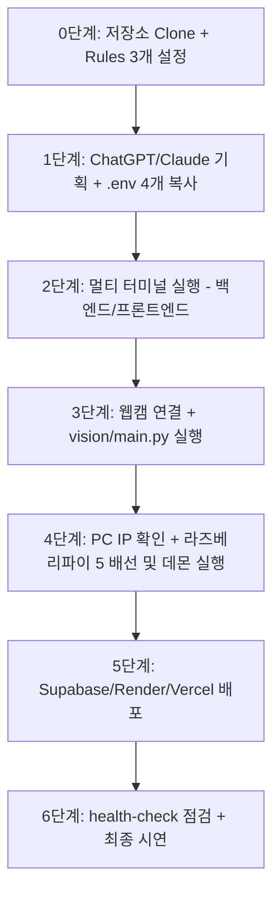

# 학생 수작업 로드맵 (체크리스트)

> 📂 **본편 02 / 팀 전원 / 수업 중 진행 체크용** · 프롬프트 원문은 [01-학생용-설치-및-사용-매뉴얼](01-학생용-설치-및-사용-매뉴얼.md) · 전체 목록 [docs/README.md](README.md)

> AI에게 프롬프트로 시키지 않고 **학생이 직접 터미널/GUI/브라우저로 실행해야 하는
> 작업만** 모은 요약 체크리스트입니다. 각 단계의 프롬프트 원문과 확인 방법은
> **`docs/01-학생용-설치-및-사용-매뉴얼.md`**를 따르고, 이 문서는 수업 중
> 진행 체크용으로 사용합니다.



## 0단계. 저장소 받기 + 하네스 구축 (팀당 1회)

- [ ] `git clone [저장소 URL] iot-vision-control-system` (또는 ZIP 다운로드)
- [ ] Antigravity 2.0 IDE에서 해당 폴더 열기
- [ ] Customizations → Rules에서 **3개만 Always On**: `karpathy-principles`,
      `security-rules`, `coding-standards` (나머지는 각 agent.md가 자동으로 불러옴)
- [ ] 사전 탑재 보일러플레이트 확인 (`backend/iot/base.py`, `backend/websocket_manager.py`, `frontend/components/dashboard/ConnectionBadge.tsx`, `vision/yolov8n.pt`)
- [ ] 0-3 ① Next.js 스캐폴드 **직접 생성** (`frontend/` 안에서 바로 실행하면 충돌로 실패 —
      반드시 임시 폴더에 만든 뒤 옮깁니다):
  ```powershell
  npx create-next-app@latest frontend-temp --ts --tailwind --eslint --app --use-npm --disable-git --no-agents-md --yes
  Get-ChildItem -Path frontend-temp -Force | Move-Item -Destination frontend
  Remove-Item frontend-temp
  ```
- [ ] 0-3 ② 백엔드 venv **직접 생성** 및 패키지 설치:
  ```powershell
  cd backend
  python -m venv venv
  .\venv\Scripts\Activate.ps1
  pip install -r requirements.txt
  cd ..
  ```
- [ ] `.gitignore` / `.env.example` / `requirements.txt`는 이미 킷에 있으므로 **AI에게 다시
      만들어달라고 하지 않습니다**

## 1단계. 팀 기획 (PRD 기반 — 토큰 0 소모) + 환경변수 준비

- [ ] 팀 미팅: `docs/부록A-팀-주제-브레인스토밍-워크시트.md`로 주제, 센서, 액추에이터, 트리거, 역할 합의
- [ ] **무료 웹 ChatGPT / Claude**에 미팅 결과를 입력해 [PRD.md] 작성
- [ ] ChatGPT / Claude에 `PRD.md` + `AGENTS.md` 2개 파일을 업로드해 완성된 `AGENTS.md` 출력받기
- [ ] Antigravity의 `AGENTS.md`에 전체 붙여넣기 저장
- [ ] `.env.example` → `.env` 4개 복사 및 `DEVICE_API_KEY` 고유값 설정:
  ```powershell
  copy backend\.env.example backend\.env
  copy frontend\.env.example frontend\.env
  copy vision\.env.example vision\.env
  copy pi\.env.example pi\.env
  ```
  *(💡 `backend/.env`, `vision/.env`, `pi/.env`의 `DEVICE_API_KEY`는 팀 고유의 임의 문자열로 동일하게 채워줍니다)*

## 2단계 (1주차). 백엔드 + DB + 대시보드 (터미널 2개 동시 유지)

- [ ] XAMPP Control Panel에서 Apache & MySQL(MariaDB) **Start**
- [ ] **[터미널 1]** 백엔드 venv 활성화 (venv 생성은 0단계에서 이미 완료):
  ```powershell
  cd backend
  .\venv\Scripts\Activate.ps1
  ```
  (스크립트 실행 오류 시 `Set-ExecutionPolicy -ExecutionPolicy RemoteSigned -Scope CurrentUser` 실행)
- [ ] 프롬프트 순서: **db-agent → 2-2-1 DB 초기화 → hardware-agent → backend-agent**
- [ ] **[터미널 1]** DB 초기화 직접 실행 (이미 `backend/`에 있으므로 `cd` 불필요):
  ```powershell
  Get-Content db\init.sql | mysql -u root
  # 'No database selected' 오류가 나면 init.sql에 CREATE DATABASE/USE 두 줄이 있는지 확인
  # mysql 명령이 없다면 phpMyAdmin 웹 화면의 SQL 탭에 복사해 실행
  ```
- [ ] **[터미널 1] 백엔드 서버 계속 실행 유지**:
  ```powershell
  uvicorn main:app --reload --port 8000
  ```
  `http://localhost:8000/docs` 및 `/health`에서 동작 확인
- [ ] **[터미널 2] 새 터미널 열기** → 프론트엔드 패키지 설치:
  ```powershell
  cd frontend
  npm install
  npm install lucide-react
  ```
- [ ] *(새 채팅)* frontend-agent 프롬프트 → 대시보드 생성 (`ConnectionBadge` 및 `suppressHydrationWarning` 적용)
- [ ] **[터미널 2] 프론트엔드 서버 계속 실행 유지**:
  ```powershell
  npm run dev
  ```
  `http://localhost:3000`에서 실시간 연결 배지("● 실시간 연결됨")와 디바이스 제어 동작 확인
- [ ] 소스 제어 GUI(Ctrl+Shift+G)로 1주차 작업 직접 커밋 (토큰 0 소모)

## 3단계 (2주차). 영상인식 → 트리거 (터미널 3개 동시 유지)

- [ ] **웹캠 충돌 방지**: Zoom, Teams, Discord, 카메라 앱 등 웹캠 점유 프로그램 모두 종료
- [ ] **[터미널 3] 새 터미널 열기** → 비전 가상환경 및 패키지 설치:
  ```powershell
  cd vision
  python -m venv venv
  .\venv\Scripts\Activate.ps1
  pip install -r requirements.txt
  ```
  (사전 포함된 `vision/yolov8n.pt` 확인 — 별도 모델 다운로드 불필요)
- [ ] *(새 채팅)* vision-agent 프롬프트 → `vision/main.py` 생성 → backend-agent 프롬프트 → 트리거 로직 연결
- [ ] **[터미널 3] 웹캠 클라이언트 실행** (현재 위치가 `vision/` 인 상태):
  ```powershell
  python main.py
  ```
- [ ] 웹캠 앞에서 감지 대상 등장/제거 시 대시보드 액추에이터 상태 자동 변화 눈으로 확인
- [ ] 소스 제어 GUI로 2주차 작업 커밋

## 4단계 (3주차). 라즈베리파이 5 마이그레이션

- [ ] *(임시 테스트 시스템으로 연습한 팀만)* `docs/부록D-iot-test-system-연동-가이드.md` 4장
      체크리스트를 백엔드 담당자가 채워 파이 담당자에게 전달
      (헤더 이름·`DEVICE_API_KEY`·`devices.id` 목록·실제 응답 JSON)
- [ ] Windows PC에서 `ipconfig` → IPv4 주소 확인 (예: `192.168.0.25`)
- [ ] `pi/.env`의 `BACKEND_URL`을 그 주소로 수정 (`http://192.168.0.25:8000`)
- [ ] *(새 채팅)* hardware-agent 프롬프트 **2개** → ① `backend/iot/hardware_provider.py` +
      `provider_factory.py` (백엔드 중계), ② `pi/main.py` (실제 GPIO 폴링 데몬)
- [ ] **전원을 끈 상태**에서 배선, **교사 입회 하**에 전원 인가
- [ ] 라즈베리파이 터미널에서 데몬 패키지 설치 + 실행 (Pi 5는 `lgpio` 필수):
  ```bash
  cd pi
  python3 -m venv venv
  source venv/bin/activate
  pip install gpiozero lgpio requests python-dotenv
  python main.py
  ```
- [ ] `backend/.env`에서 `DEVICE_MODE=hardware`로 전환
- [ ] 대시보드 버튼/웹캠 감지로 실제 라즈베리파이 반응 확인
- [ ] 소스 제어 GUI로 3주차 작업 커밋

## 5단계 (4주차). 클라우드 배포

- [ ] *(새 채팅)* db-agent 프롬프트(Supabase DDL/RLS) → deploy-agent 프롬프트(배포 설정)
- [ ] Supabase 프로젝트 생성 → SQL Editor에서 마이그레이션 SQL 실행
- [ ] Render에서 백엔드 Web Service 생성 + 환경변수 등록
- [ ] Vercel에서 프론트엔드 프로젝트 생성 + `NEXT_PUBLIC_API_BASE_URL` 등록
- [ ] 배포 URL로 최종 통합 시연 (영상인식 → 트리거 → 실기기 제어 전체 경로)

## 6단계. 정기 점검 (상시)

- [ ] 기능 추가할 때마다 `".agents/workflows/health-check.md 워크플로우를 참고해서 점검해줘"` 프롬프트 입력해 점검 결과 보고받기
- [ ] 오류 발생 시 에러 로그만 복사해 `.agents/workflows/bugfix.md` 프롬프트로 최소 범위 수정 요청 (전체 재작성 요청 금지)
