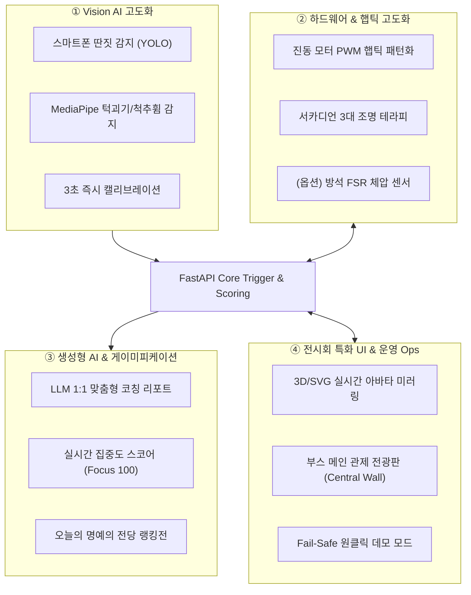

# 04. 작품전시회 기능확장 아이디어 및 10주 개발 로드맵

> 📂 **본편 / 전시 대비 특화 가이드** · 전체 목록 [docs/README.md](README.md)  
> 🎯 **대상**: 팀 전원 (기획, 프론트엔드, 백엔드/DB, 하드웨어, 영상인식)  
> 📅 **목표 D-Day**: 11월 중순 작품전시회 (총 10주 개발 일정)

---

## 1. 개요 (Overview)

본 문서는 **"AI 스마트 학습 좌석 (온디바이스 비전 AI 기반 학습 케어 및 자세 교정 플랫폼)"** 프로젝트를 **11월 중순 작품전시회**에서 성공적으로 시연하고, 심사위원과 관람객에게 확실한 기술적 임팩트('와우 포인트')를 전달하기 위한 **기능 확장 아이디어**, **역할별 세부 작업 분담**, 그리고 **10주 통합 개발 로드맵**을 정의합니다.

기존 1차 완성본(기본 백엔드, 로컬 DB, 웹 대시보드, 웹캠 비전 클라이언트)과 2차 필수 과제(라즈베리파이 5 실제 배선 및 클라우드 배포)를 안정적으로 완수하는 동시에, 전시 현장의 특성을 반영한 킬러 기능을 유기적으로 결합합니다.

---

## 2. 전시회 관점에서의 시스템 진단 및 극복 과제

| 현재 구현 항목 | 전시 부스 환경의 현실적 제약 | 개선 및 확장 방향 (해결책) |
|---|---|---|
| **긴 반응 대기 시간** | 관람객 1인당 부스 체류 시간은 **1분~2분** 내외로 매우 짧음 | 착석 즉시 **3초 만에 신체 기준점을 자동 세팅(Instant Calibration)**하고 즉각 반응하는 초단기 인터랙션 구현 |
| **단순한 감지 항목** (단순 눈감음, 얼굴 Y축 하강) | "단순 웹캠 오픈소스를 띄운 것 아닌가?"라는 평가를 받을 위험 | 학습 시 최대 방해 요소인 **스마트폰 딴짓 감지(YOLO)**, **턱 괴기/척추 휨 감지(MediaPipe)** 등 다차원 분석 적용 |
| **단순 On/Off 하드웨어** (단순 윙- 진동, LED 단순 점등) | 진동과 조명이 평범하여 하드웨어 완성도 및 감성 품질 저하 | **상황별 햅틱 진동 패턴(펄스/탭/강약)**, **3대 학습 모드별 조명(집중/독서/휴식)** 등 감각적 피드백 제공 |
| **정적인 리포트 그래프** | 단순 수치 그래프는 스마트폰에서 관람객의 흥미 유발 부족 | **생성형 AI(LLM) 맞춤 피드백 코칭** 및 관람객 간 **실시간 집중도 랭킹전(게이미피케이션)** 도입 |
| **현장 돌발상황 취약성** (전시장 조명 역광, 통신 지연) | 비전 인식이 현장에서 튀거나 실패할 경우 시연 실패 위험 | 원클릭으로 정해진 시연 시나리오를 완벽 재현하는 **'전시 시연(Fail-Safe Demo) 모드'** 탑재 |

---

## 3. 전시회 흥행을 위한 4대 핵심 킬러 기능 (4-Pillars)



### ① [Vision AI] 스마트폰 딴짓 감지 & 다차원 자세 분석 + 3초 자동 캘리브레이션

1. **스마트폰 딴짓 실시간 감지 (YOLOv8 Phone Detection)**
   - **동작**: 관람객이 책상에 앉아 스마트폰을 집어 들거나 내려다보는 순간을 즉시 포착.
   - **피드백**: 화면에 `"집중 경고: 스마트폰 사용 감지!"` 팝업 + 등받이 진동 2회(툭-툭) + 스탠드 조명 순간 주황색 점멸.
   - **가치**: 현대 학습 환경에서 가장 직관적이고 공감대 높은 킬러 기능으로 평가위원의 주목 유도.

2. **MediaPipe 기반 턱 괴기 및 척추 좌우 휨 감지 (Multi-Posture)**
   - 단순 얼굴 Y축 하강 외에 **손이 턱/볼에 닿는 행위(Hand-to-Chin)**, **고개 좌우 기울임(Head Tilt)**을 감지.
   - 척추 측만 및 거북목을 유발하는 복합적인 나쁜 자세를 정밀하게 식별.

3. **관람객 3초 원터치 캘리브레이션 (Instant Calibration)**
   - 부스에 관람객이 앉을 때 키와 앉은키가 모두 다름.
   - 착석 감지 직후 화면에 `"3초간 정면을 응시해 주세요"` 애니메이션 표시 후 기준 높이($Y_{base}$)와 눈 깜빡임 기준치(EAR threshold)를 자동 산정하여 오탐률 최소화.

---

### ② [Hardware / IoT] 멀티 패턴 햅틱 & 스마트 조명 테라피 + (선택) 체압 센서

1. **상황별 햅틱 진동 패턴 (PWM / 타이밍 펄스)**
   - 단순 On/Off 대신 소프트웨어적 펄스 제어로 진동 피드백에 감성 부여:
     - **자세 교정(등받이 모터 A)**: 부드럽게 톡-톡 두드리는 탭(Tap) 패턴 (자세를 펴라는 부드러운 가이드)
     - **졸음 방지(방석 모터 B)**: 점점 강해지는 3연속 펄스 진동 (잠을 깨우는 알람)
     - **스마트폰 딴짓**: 짧고 강한 스타카토 진동
2. **학습 테라피 조명 프리셋 (Circadian Lighting)**
   - 좌석 터치 디스플레이에서 3가지 조명 모드 선택:
     - **집중 모드**: 쿨화이트 (6000K, 고밝기) — 수학/수리 연산, 고도의 집중 암기
     - **독서 모드**: 웜화이트 (4000K, 중간밝기) — 편안한 어학 및 독서
     - **휴식/명상 모드**: 앰버/주황 (2700K, 은은한 브리딩 조명) — 휴식 및 스트레칭
3. **[선택/가산점] 의자 방석 좌우 압력 센서(FSR) 연동**
   - 방석 좌/우에 얇은 FSR 필름 압력센서 2개를 배치하여 **"다리 꼬기"**, **"골반 쏠림"** 감지.
   - 비전(상체) + 압력(하체) 융합 멀티모달(Multi-modal) 감지 좌석으로 업그레이드.

---

### ③ [Generative AI & Data] LLM 맞춤형 학습 코칭 리포트 & 실시간 랭킹전

1. **LLM(Gemini / OpenAI API) 기반 1:1 맞춤형 피드백 생성**
   - 퇴실 시 백엔드가 해당 세션의 통계(체험 시간, 졸음 횟수, 거북목 누적 시간, 스마트폰 딴짓 횟수)를 프롬프트로 구성하여 LLM 호출.
   - 예시 생성 결과:
     > *"오늘 체험자님은 총 2분 동안 88%의 높은 집중도를 유지하셨습니다! 다만 턱을 괴고 스마트폰을 확인하는 동작이 1회 감지되었습니다. 목과 승모근 긴장 완화를 위해 좌우 목 스트레칭을 권장하며, 학습 중 스마트폰은 시야 밖 거치대에 보관하세요."*
   - 모바일 웹 리포트 최상단에 **'AI 학습 주치의의 코칭 한마디'** 카드로 제공.

2. **실시간 집중도 스코어 (Focus Score 100) & 명예의 전당 (게이미피케이션)**
   - 100점 만점에서 자세 불량(-5점), 스마트폰(-15점), 졸음(-10점)을 실시간 감점 반영.
   - 퇴실 시 닉네임을 입력하면 **"오늘의 명예의 전당 (Top Focus Ranker)"**에 실시간 등록되어 관람객 간 집중도 대결 유도.

---

### ④ [Frontend & Exhibition Ops] 실시간 3D 아바타 & 부스 관제 화면

1. **실시간 인체 자세 미러링 (Digital Twin Avatar)**
   - 터치 디스플레이에 귀여운 SVG/Three.js 3D 캐릭터가 착석.
   - 관람객이 등을 구부리면 화면 속 캐릭터 척추가 붉은색으로 휘어지고, 졸면 눈을 감으며 고개를 숙이는 애니메이션 실시간 연동.
2. **전시 부스 메인 관제 전광판 (Central Wall View)**
   - 부스 벽면에 걸어둘 대형 모니터/TV용 관제 화면.
   - 1번 좌석의 실시간 상태 미러링 + "오늘 누적 체험자 수", "평균 집중 점수", "가장 많이 감지된 자세 불량 유형" 통계를 그래프로 표출.
3. **안전장치: 원클릭 전시 시연 모드 (Fail-Safe Demo Mode)**
   - 전시장 조명 역광이나 통신 이상으로 AI 인식이 원활하지 않거나, 심사위원이 빠른 시연을 원할 때:
   - 관리자 패널 버튼(`[졸음 시연]`, `[거북목 시연]`, `[스마트폰 시연]`) 클릭 시 1초 만에 하드웨어(모터/조명/화면)가 100% 정상 작동하도록 보장하는 안전장치.

---

## 4. 팀원 4인 역할별 기능 분담 상세

```
[팀원A] Frontend  ── 좌석 터치 Kiosk UI (3D 아바타), 모바일 QR AI 리포트, 부스 관제 전광판
[팀원B] Backend   ── 멀티 트리거 엔진 고도화, LLM 리포트 API, 세션 스코어링 & 데모 시뮬레이터
[팀원C] Hardware  ── 라즈베리파이 5 핀 배선, 진동 PWM 햅틱 패턴, 서카디언 조명 제어, (옵션) FSR 센서
[팀원D] Vision AI ── YOLOv8 스마트폰 감지, MediaPipe 다차원 자세 분석, 3초 원터치 캘리브레이션
```

| 팀원 | 역할 | 기존 2차 개발 기본 과제 | 전시회 특화 추가 구현 과제 |
|---|---|---|---|
| **팀원A**<br>(Frontend) | 프론트엔드 | • Next.js 실시간 대시보드 연동<br>• Vercel 클라우드 배포<br>• 기본 QR 퇴실 리포트 페이지 | • 좌석 터치 Kiosk UI 개선 (실시간 3D/SVG 아바타, 뽀모도로 타이머)<br>• 모바일 전용 AI 코칭 리포트 뷰 & 명예의 전당 랭킹 페이지<br>• 부스 벽면용 대형 관제 전광판 화면 개발 |
| **팀원B**<br>(Backend·DB) | 백엔드 & DB | • Supabase PostgreSQL 마이그레이션<br>• Render 클라우드 배포<br>• 디바이스 상태 REST/WS API 안정화 | • 복합 이벤트(스마트폰+자세+졸음) 다단계 트리거 엔진 고도화<br>• LLM(Gemini/OpenAI) API 연동 학습 코칭 프롬프트 엔진<br>• 세션 집중도 스코어링(100점) 알고리즘 & 원클릭 데모 API |
| **팀원C**<br>(Hardware) | 라즈베리파이 5 | • GPIO 실제 핀 배선 (LED, 모터 2개, 릴레이)<br>• `pi/main.py` lgpio 데몬 폴링 연동<br>• 하드웨어 안정성 검증 | • 진동 모터 소프트웨어 PWM 햅틱 패턴(탭, 펄스, 스타카토) 구현<br>• RGB 조명 3대 모드(집중/독서/휴식) 및 경고 브리딩 구현<br>• (선택/가산점) 의자 방석 FSR 체압 센서 ADC/GPIO 연동 |
| **팀원D**<br>(Vision AI) | 영상인식 AI | • 웹캠 착석/눈감음(EAR)/얼굴 높이 감지<br>• 백엔드 이벤트 전송 파이프라인 안정화 | • YOLOv8 스마트폰 인식 모델 경량화 파이프라인 추가<br>• MediaPipe 턱 괴기 및 척추 좌우 휨 감지 로직 추가<br>• 관람객 착석 즉시 3초 자동 캘리브레이션 알고리즘 구현 |

---

## 5. 11월 중순(전시회) 대비 10주 개발 로드맵

전시회 일정(11월 중순, 약 10주)에 맞추어 **1단계: 기존 2차 완성(4주) → 2단계: 추가 킬러 기능 구현(4주) → 3단계: 통합 리허설 및 현장 패키징(2주)**으로 진행합니다.

```
[9월 1주~4주] Phase 1: 기존 2차 필수 과제 완성 (라즈베리파이 배선 + 클라우드 배포)
     ▼
[10월 1주~4주] Phase 2: 전시회 킬러 기능 구현 (스마트폰 감지, 햅틱 패턴, LLM 리포트, 3D 아바타)
     ▼
[11월 1주~2주] Phase 3: 하우징 패키징 & 현장 스트레스 테스트 & 최종 시연 리허설
```

### 주차별 상세 일정표

| 단계 | 주차 | 개발 마일스톤 | 세부 작업 내용 | 완료 산출물 |
|---|---|---|---|---|
| **Phase 1<br>(기존 2차<br>완성)** | **1주차<br>(9/7~9/13)** | **하드웨어 핀 배선 및<br>기본 통신 검증** | • [HW] 라즈베리파이 5에 LED 바, 진동 모터 2개, 릴레이 브레드보드 배선<br>• [HW] `pi/main.py` 기본 polling 루프 구동 및 백엔드 연동 테스트<br>• [BE] 로컬 DB ↔ 백엔드 REST/WS 1차 전구간 검증 | 핀 배선 완료 하드웨어,<br>기본 통신 로그 확인 |
| | **2주차<br>(9/14~9/20)** | **비전 파이프라인 안정화 &<br>클라우드 마이그레이션** | • [Vision] 웹캠 기반 착석, EAR 눈감음, 얼굴 Y축 감지 튜닝<br>• [BE] MySQL 스키마를 Supabase(PostgreSQL)로 마이그레이션<br>• [BE/FE] Render(백엔드) 및 Vercel(프론트엔드) 배포 | 클라우드 구동 URL,<br>안정화된 비전 클라이언트 |
| | **3~4주차<br>(9/21~10/4)** | **기본 파이프라인 전구간 통합 &<br>1차 동작 검증** | • 웹캠 감지 → FastAPI 트리거 → 라즈베리파이 모터/조명 → 웹 대시보드 실물 구동<br>• 기본 QR 코드 퇴실 세션 리포트 연동 테스트<br>• 팀 전체 1차 전구간 통합 구동 점검 (중간 마일스톤) | **1차 전구간 실물 구동 성공** |
| **Phase 2<br>(추가 기능<br>구현)** | **5주차<br>(10/5~10/11)** | **비전 AI 고도화 &<br>햅틱/조명 제어 패턴화** | • [Vision] YOLOv8 스마트폰 감지 모델 추가 & 3초 캘리브레이션 구현<br>• [HW] 진동 모터 PWM 햅틱 패턴(탭/펄스/강약) 및 조명 3대 모드 구현<br>• [BE] 신규 이벤트(`phone`, `calibration`) 처리 스키마 확장 | 스마트폰 감지 비전,<br>햅틱 패턴 라이브러리 |
| | **6주차<br>(10/12~10/18)** | **생성형 AI 리포트 &<br>인터랙티브 UI 구축** | • [BE] LLM(Gemini/OpenAI) API 연동 개인화 코칭 리포트 엔드포인트 개발<br>• [FE] 좌석 터치 UI에 실시간 3D/SVG 아바타 자세 미러링 구현<br>• [Vision] MediaPipe 턱 괴기 및 고개 기울임 감지 로직 결합 | LLM 코칭 생성 API,<br>3D 아바타 터치 UI |
| | **7주차<br>(10/19~10/25)** | **게이미피케이션 &<br>부스 관제 전광판 완성** | • [FE] 모바일 QR 리포트 뷰 고도화 (레이더 차트 + AI 코칭 카드)<br>• [FE] 명예의 전당 실시간 랭킹 시스템 구축<br>• [FE/BE] 부스 벽면용 대형 관제 전광판(Central Wall) 개발 | 모바일 리포트 웹앱,<br>중앙 관제 전광판 |
| | **8주차<br>(10/26~11/1)** | **추가 기능 통합 연동 &<br>Fail-Safe 데모 모드 구축** | • 신규 추가 기능 4개 축 전구간 연동 테스트<br>• [BE/FE] 심사위원용 원클릭 시연 시뮬레이터(Fail-Safe Demo Mode) 완성<br>• 하드웨어 햅틱 및 조명 강도 최종 튜닝 | **전시 완성본 기능 동결**<br>(Feature Freeze) |
| **Phase 3<br>(안정화 &<br>전시 준비)** | **9주차<br>(11/2~11/8)** | **하우징 패키징 &<br>전시장 스트레스 테스트** | • 실제 의자/책상에 배선 매립 및 케이블 정리(하우징 패키징 완성)<br>• 전시장 환경(모바일 핫스팟, 현장 조명 역광) 모의 테스트 및 예외 처리<br>• 시연 반복 스트레스 테스트 (메모리 누수, 프로세스 재시작 데몬 점검) | 완성된 전시용 가구 시제품,<br>현장 환경 대응 가이드 |
| | **10주차<br>(11/9~11/15)** | **현장 리허설 &<br>발표 자료 제작 (D-Day)** | • 1분/3분 관람객 체험 시나리오 대본 확정 및 팀원별 현장 리허설<br>• 전시 부스 포스터, 리플릿, 사용 안내 배너 제작<br>• **작품전시회 부스 운영 및 심사위원 시연** | **전시회 성공 출품** |

---

## 6. 전시 당일 현장 시연 시나리오 (1분 30초 필승 코스)

전시 부스에 심사위원 또는 관람객이 방문했을 때 진행할 표준 시연 흐름입니다:

```
[1] 착석 & 3초 캘리브레이션 (0~15초)
    └─ 의자에 앉으면 조명 On, 화면 On, "3초 신체 캘리브레이션 완료!"
          ▼
[2] 자세 교정 햅틱 체험 (15~35초)
    └─ 등을 굽히거나 턱을 괴면 ➔ 등받이 진동(툭-툭) + 아바타 척추 붉은색 변화
          ▼
[3] 스마트폰 딴짓 감지 (35~55초)
    └─ 스마트폰을 꺼내 들면 ➔ 스탠드 조명 주황색 점멸 + 화면 경고
          ▼
[4] 졸음 케어 피드백 (55~75초)
    └─ 눈을 지긋이 감으면 ➔ 방석 진동(강한 3연속 펄스) + 조명 번쩍임
          ▼
[5] 퇴실 & 스마트폰 QR 리포트 (75~90초)
    └─ [퇴실] 버튼 터치 ➔ QR 스캔 ➔ 모바일 웹에 AI 코칭 한마디 & 랭킹 등록
```

---

## 7. 전시장 현장 돌발상황 대응 가이드 (Fail-Safe)

전시 현장에서는 예측하지 못한 네트워크 단절, 조명 간섭 등이 발생할 수 있습니다. 아래 3가지 안전장치를 필수로 구축합니다.

1. **네트워크 단절 대비 (로컬 핫스팟 모드)**
   - 행사장 Wi-Fi는 매우 불안정하므로 스마트폰 테더링(LTE/5G) 또는 소형 유무선 공유기를 부스 전용망으로 세팅.
   - 클라우드 서버 외에 현장 노트북의 로컬 백엔드(`http://localhost:8000`)로 즉시 스위칭 가능한 `.env` 환경변수 준비.
2. **조명 역광 및 인식 불안정 대비 (원클릭 데모 모드)**
   - 전시장 핀조명이나 역광으로 웹캠 인식이 튈 경우, 좌석 터치스크린 우하단 숨김 버튼이나 관리자 스마트폰에서 `[졸음 시연]`, `[거북목 시연]`, `[스마트폰 시연]` 클릭 시 백엔드가 모의 이벤트를 주입하여 하드웨어가 100% 동작하도록 보장.
3. **하드웨어 프로세스 자동 복구**
   - 라즈베리파이 데몬(`pi/main.py`) 및 비전 클라이언트에 `systemd` 또는 무한 루프 재연결(`try-except Exception`)을 적용하여 케이블이 일시적으로 빠졌다 꽂혀도 자동 복구되도록 구현.
