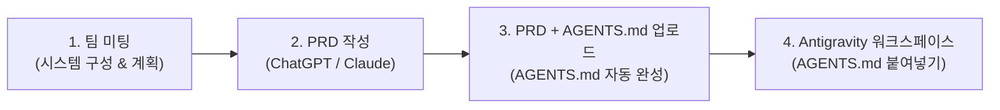

# ChatGPT / Claude로 AGENTS.md 작성하기 (1단계 · PRD 경유)

> 📂 **부록B / 팀 전원 / 1단계 — 부록A에서 정한 내용을 `AGENTS.md`로 완성할 때** · 전체 목록 [docs/README.md](README.md)

> 💡 **개요**: 학생들은 1단계 기획 단계에서 **팀 미팅(시스템 구성/개발 계획) → AI 활용 PRD 작성 → PRD 파일 + `AGENTS.md` 업로드** 과정을 통해, Antigravity(Gemini) 토큰을 전혀 쓰지 않고 브라우저의 무료 **ChatGPT / Claude**로 5분 만에 완벽한 `AGENTS.md`를 완성합니다.

---

## 🎯 왜 이 3단계 워크플로우를 사용하나요?



1. **체계적인 엔지니어링 사고**: 팀 미팅으로 요구사항을 도출하고 실제 개발 현업처럼 **PRD(제품 요구사항 정의서)**를 먼저 작성합니다.
2. **스타터 킷 구조 100% 보존**: AI에게 PRD와 함께 스타터 킷의 `AGENTS.md` 원본을 제공함으로써 기술 스택·폴더 구조·AI 규칙을 훼손하지 않고 팀 맞춤형 파일로 완성합니다.
3. **Antigravity 토큰 소모 0 (완전 무료)**: 학생 무료 계정의 Gemini API 토큰을 소모하지 않고 무료 웹 AI를 활용합니다.

---

## 🚀 3단계 상세 실행 절차

---

### [1단계] 팀 미팅: 시스템 구성 및 개발 계획 수립

팀원 4명이 모여 `docs/부록A-팀-주제-브레인스토밍-워크시트.md`를 참고하여 아래 6가지 핵심 항목을 합의합니다:

| 항목 | 합의 내용 예시 |
|---|---|
| **1. 팀 주제 / 목표** | 스마트 실습실 재실 및 에너지 관리 시스템 |
| **2. 센서 (모니터링)** | 온도 센서(`temp_1`), 조도 센서(`light_1`) |
| **3. 액추에이터 (제어)** | 실습실 메인 조명 LED(`led_1`), 환기팬 서보/릴레이(`fan_1`) |
| **4. 영상인식 감지 대상** | 웹캠 사람 감지 (재실 여부 파악 — YOLOv8n) |
| **5. 트리거 규칙** | 사람이 감지되면 조명 ON, 5분간 미감지 시 조명/팬 자동 OFF |
| **6. 4인 역할 분담** | 이름A(frontend), 이름B(backend·db), 이름C(hardware), 이름D(vision) |

---

### [2단계] ChatGPT / Claude 활용 PRD(제품 요구사항 정의서) 작성

1. 브라우저에서 **ChatGPT**([https://chatgpt.com](https://chatgpt.com)) 또는 **Claude**([https://claude.ai](https://claude.ai))에 접속합니다.
2. 팀 미팅 결과를 바탕으로 아래 **PRD 생성 프롬프트**를 입력합니다.

#### 📝 PRD 생성 프롬프트
```text
너는 고등학교 마이스터/특성화고 학생들을 지도하는 "IoT·AI 스마트 시스템 전문 PM(프로덕트 매니저)"이야.
우리 팀이 회의를 통해 결정한 아래 시스템 구성을 바탕으로 깔끔하고 구조화된 [PRD(Product Requirement Document, 제품 요구사항 명세서)]를 마크다운 형식으로 작성해줘.

[우리 팀 미팅 결과]
1. 프로젝트 주제: [예: 스마트 실습실 재실 및 에너지 관리 시스템]
2. 해결하려는 문제: [예: 방과 후 실습실에 사람이 없는데도 조명/냉난방이 켜져 있어 에너지 낭비 발생]
3. 센서 목록: [예: 온도 센서(temp_1), 조도 센서(light_1)]
4. 액추에이터 목록: [예: LED 조명(led_1), 환기팬(fan_1)]
5. 영상인식 대상: [예: 웹캠 사람 감지(재실 여부)]
6. 핵심 트리거 규칙: [예: 사람 감지 시 조명 ON, 5분간 미감지 시 조명/팬 OFF]
7. 팀원 역할: [예: 홍길동(frontend), 김철수(backend·db), 이영희(hardware), 박민수(vision)]

[PRD 포함 항목]
- 프로젝트 개요 및 배경
- 시스템 아키텍처 및 데이터 흐름
- 센서 및 액추에이터 상세 사양
- 영상인식 및 자동 제어 트리거 시나리오
- 팀원별 R&R (역할과 책임)

작성된 PRD 내용을 마크다운으로 깔끔하게 출력해줘.
```

3. AI가 생성한 PRD 내용을 복사하여 메모장이나 에디터에 `PRD.md` 파일로 저장(또는 텍스트 복사 준비)합니다.

---

### [3단계] PRD 파일 + `AGENTS.md` 업로드로 최종 완성

1. 파일 탐색기에서 아래 **2개 파일**을 ChatGPT / Claude 대화창에 **드래그 앤 드롭(또는 파일 첨부 📎)**합니다:
   - 방금 작성한 **`PRD.md`** (또는 PRD 내용 텍스트)
   - 프로젝트 스타터 킷의 **`AGENTS.md`**

2. 파일 첨부와 함께 아래 **AGENTS.md 변환 프롬프트**를 입력합니다:

#### 📝 AGENTS.md 변환 프롬프트
```text
첨부한 [PRD.md]와 스타터 킷의 [AGENTS.md] 파일을 확인해줘.

[PRD.md]의 기획 내용을 바탕으로, 스타터 킷의 [AGENTS.md]를 우리 팀 맞춤형으로 완성해줘.

⚠️ [엄격 준수 규칙 - 스타터 킷 호환성 유지]
1. `AGENTS.md`에 정의된 [기술 스택], [핵심 데이터 흐름], [AI 사용 원칙], [폴더 구조] 섹션은 스타터 킷의 표준 규격이므로 절대 변경하거나 생략하지 말고 100% 원본 그대로 유지할 것.
2. 상단의 [프로젝트 개요]와 하단의 [## 팀 정보] 표의 빈칸(`[ ]`)을 PRD.md의 내용으로 정확하게 채워 넣을 것.
3. 결과물은 스타터 킷 루트의 `AGENTS.md`에 바로 덮어쓸 수 있도록 전체 마크다운 코드 블록(```markdown ... ```)으로 출력할 것.
```

3. AI가 출력한 완성본 마크다운 코드 블록 전체를 복사합니다.

---

### [적용] Antigravity 워크스페이스에 반영

1. Antigravity IDE에서 루트 디렉토리의 **`AGENTS.md`** 파일을 엽니다.
2. AI가 출력한 완성본 내용으로 **전체 덮어쓰기 (Ctrl+A → Ctrl+V → Ctrl+S)** 합니다.
3. PowerShell 터미널을 열고 4대 서브프로젝트의 `.env` 파일을 복사합니다:
   ```powershell
   copy backend\.env.example backend\.env
   copy frontend\.env.example frontend\.env
   copy vision\.env.example vision\.env
   copy pi\.env.example pi\.env
   ```

---

## 📋 최종 완성 예시 (`AGENTS.md`)

````markdown
# AGENTS.md — smart-lab-control

## 프로젝트 개요
- 팀 주제: `스마트 실습실 재실 및 에너지 관리 시스템`
- 한 줄 목표: `웹캠 사람 감지(YOLO)와 온습도/조도 센서 데이터를 기반으로 실습실 조명과 환기팬을 자동 제어하는 스마트 IoT 시스템`

## 기술 스택 (고정 — 임의로 바꾸지 않는다)
- 백엔드: FastAPI (Python)
- DB: MySQL/MariaDB (로컬 개발) → Supabase(PostgreSQL) (클라우드 배포 시 마이그레이션)
- 프론트엔드: Next.js(TypeScript)
- 하드웨어 제어: Python venv Mock(개발 전반부) → 라즈베리파이 5 + gpiozero(개발 후반부)
- 영상인식: YOLO/mediapipe (Windows PC + 웹캠)
- 배포: Render(백엔드) / Vercel(프론트)
- 버전관리: GitHub / 문서·협업: Notion

## 핵심 데이터 흐름
1. 웹캠(vision 클라이언트)이 프레임을 분석해 감지 이벤트를 백엔드로 전송한다
2. 백엔드가 이벤트를 받아 팀이 정한 트리거 규칙에 따라 액추에이터 desired-state를 갱신한다
3. 하드웨어(Mock 또는 라즈베리파이)가 desired-state를 폴링해 실제로 반영한다
4. 프론트엔드 대시보드는 WebSocket으로 현재 상태를 실시간 표시한다

## AI 사용 원칙
- 모든 작업은 `.agents/rules/karpathy-principles.md`의 4원칙(생각 먼저·단순함 우선·
  외과적 변경·목표 기반 실행)을 기본으로 따른다
- AI가 생성한 코드는 반드시 학생이 직접 실행하고 결과를 눈으로 확인한다
- "AI가 알아서 잘했다"는 요약만 믿고 다음 단계로 넘어가지 않는다
- 시크릿(API 키, 비밀번호)은 절대 채팅/프롬프트에 직접 입력하지 않는다 (security-rules.md 참고)
- 이 킷의 `.agents/rules`, `.agents/skills`는 이미 완성되어 있다 — **다시 만들어달라고
  요청하지 않는다.** 새 기능을 요청할 때 "역할 지정 + 관련 rules/skills 참고" 문구만
  붙이면 AI가 알아서 참고한다 (토큰 절약)

## 폴더 구조
```
[프로젝트폴더명]/
├── AGENTS.md
├── .agents/            (하네스: rules/skills/workflows/hooks/agents — 이미 완성됨)
├── docs/               (설치 매뉴얼·로드맵·인터페이스 가이드 — 이미 완성됨)
├── backend/            (FastAPI, .env.example 포함)
├── frontend/           (Next.js, .env.example 포함)
├── vision/             (영상인식 클라이언트, Windows PC에서 실행, .env.example 포함)
└── pi/                 (라즈베리파이에서 실행되는 하드웨어 데몬, 3주차부터, .env.example 포함)
```

## 팀 정보 (아래 표를 채운다 — AI에게 시키지 않고 직접 채운다)

| 항목 | 값 |
|---|---|
| 팀 주제 | 스마트 실습실 재실 및 에너지 관리 시스템 |
| 액추에이터(제어 대상) 목록 | 스마트 조명 LED(led_1), 환기팬(fan_1) |
| 센서(모니터링 대상) 목록 | 온도 센서(temp_1), 조도 센서(light_1) |
| 영상인식 감지 대상 | 사람 감지(재실 여부 — YOLOv8n) |
| 트리거 규칙 | 사람 감지 시 조명 ON, 5분간 미감지 시 조명 및 환기팬 OFF |
| 팀원 역할 분담 | 홍길동 → frontend / 김철수 → backend·db / 이영희 → hardware / 박민수 → vision |
````

🎉 **1단계 기획 및 `AGENTS.md` 완성이 끝났습니다! 이제 `2단계(1주차 - Mock 백엔드+DB+대시보드)`로 진행하세요.**
