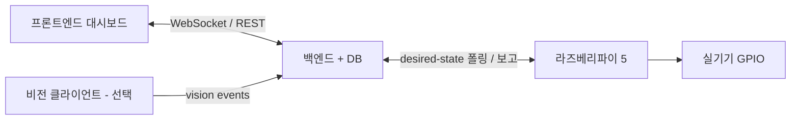
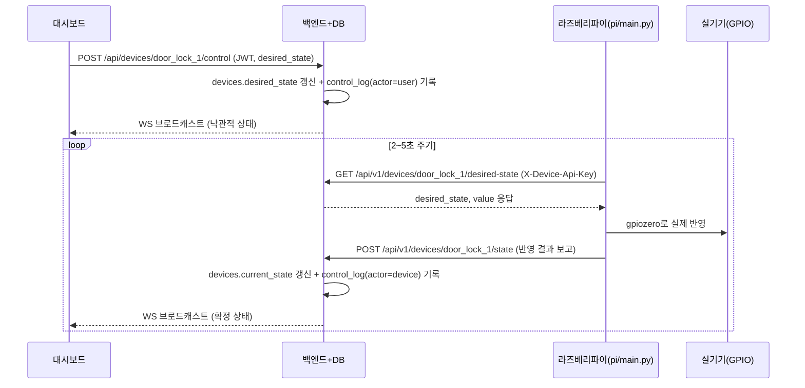

# 백엔드(DB 포함) ↔ 라즈베리파이 5 개발 인터페이스 가이드

> 📂 **부록C / 백엔드·DB 담당 + 라즈베리파이 담당 / 4단계 이후** · 전체 목록 [docs/README.md](README.md)

> **언제 이 문서를 보나요?** `docs/01-학생용-설치-및-사용-매뉴얼.md`의 **4단계(3주차)
> 하드웨어 마이그레이션**까지 마치고 나면, 라즈베리파이 5 관련 개발(새 액추에이터 추가, 폴링
> 로직 개선, 배선 변경 등)은 보통 팀 안의 한 명(**라즈베리파이 5 담당자**)이 전담해서
> 이어갑니다. 이때부터 라즈베리파이 담당자와 백엔드·DB 담당자는 서로의 코드를 매번 들여다보지
> 않아도, 아래에 정리된 **계약(contract)** 만 지키면 각자 독립적으로 개발하다가 문제없이 다시
> 합쳐질 수 있습니다. 프론트엔드·비전(선택) 담당자가 직접 구현할 부분은 아니지만, 3장(REST
> 계약)과 7장(WebSocket 브로드캐스트)이 대시보드에 그대로 반영되는 값이므로 참고하면 좋습니다.

> 핵심만 먼저 말하면: **① 3장의 REST 엔드포인트·JSON 모양, ② 동일한 `DEVICE_API_KEY`,
> ③ `devices` 테이블의 `id` 목록** — 이 3가지만 두 담당자가 똑같이 맞추면, 나머지 내부 구현
> (백엔드가 DB를 어떻게 쓰는지, 파이가 GPIO를 어떻게 다루는지)은 서로 몰라도 됩니다.

---

## 0. 이 문서의 목적과 대상

| 역할 | 소유(직접 수정하는) 파일/폴더 | 상대방에게 반드시 공유해야 하는 것 |
|---|---|---|
| 백엔드·DB 담당자 | `backend/main.py`, `backend/iot/`, `backend/db/`(스키마·시드) | 이 문서의 REST 계약대로 구현된 엔드포인트, `DEVICE_API_KEY`, `devices` 테이블의 `id` 목록, 백엔드가 떠 있는 PC의 로컬 IP(`BACKEND_URL`에 들어갈 값) |
| 라즈베리파이 5 담당자 | `pi/main.py`, `pi/.env`, GPIO 배선 | (선택) 자신이 어떤 device_id를 어떤 핀에 연결했는지, 폴링이 정상 동작하는지 여부 |

두 담당자는 이 문서에 적힌 계약만 지키면 서로 다른 시간에, 서로 다른 기기(Windows PC / 라즈베리파이)에서 독립적으로 작업할 수 있습니다. 계약 자체를 바꿔야 할 때는 9장 절차를 따릅니다.

---

## 1. 전체 아키텍처



- 라즈베리파이는 고정 공인 IP가 없을 수 있으므로 **항상 파이가 백엔드를 먼저 찾아갑니다
  (polling).** 백엔드가 파이의 IP를 알아내 직접 접속하는 일은 없습니다 (`hardware-rules.md`
  통신 방식).
- 이 구조에서 백엔드·DB 담당자와 라즈베리파이 담당자가 실제로 맞닿는 지점은 위 그림의
  "desired-state 폴링 / 보고" 화살표, 딱 하나입니다. 3장에서 이 화살표의 정확한 모양을
  정의합니다.

---

## 2. 설계 원칙 — Provider "패턴"은 공유하지만 코드·프로세스는 공유하지 않는다

`backend/iot/base.py`의 `DeviceProvider`는 아래 4개 메서드를 정의합니다(이미 완성되어 있으니
그대로 사용합니다):

```python
class DeviceProvider(ABC):
    async def get_device_status(self, device_id: str) -> Optional[Dict[str, Any]]: ...
    async def set_actuator_state(self, device_id: str, desired_state: str,
                                  value: Optional[Any] = None, operator: str = "user") -> Dict[str, Any]: ...
    async def read_sensor_value(self, device_id: str) -> Dict[str, Any]: ...
    async def get_all_statuses(self) -> List[Dict[str, Any]]: ...
```

혼동하기 쉬운 부분을 먼저 명확히 짚고 넘어갑니다.

- 백엔드 프로세스(학생 PC, 배포 후에는 Render)와 라즈베리파이 데몬(`pi/main.py`)은 **서로 다른
  기기에서 따로 실행되는 별도 프로세스**입니다. `pi/main.py`가 `backend/iot/base.py`를 직접
  `import`하는 일은 없습니다 — 물리적으로 다른 기기이므로 import 자체가 불가능합니다.
- 그래서 `pi/main.py` 안의 `HardwareDeviceProvider`는 **같은 4개 메서드 이름을 그대로 다시
  구현한, 파이 전용의 독립적인 클래스**입니다. "인터페이스를 지킨다"는 말은 "코드를
  공유한다"는 뜻이 아니라 "같은 이름·같은 역할의 메서드로 맞춘다"는 **명명 규약**을 뜻합니다.
- `DEVICE_MODE=hardware`가 되어도 백엔드는 GPIO를 절대 직접 만지지 않습니다. 백엔드는
  desired-state를 저장·제공하고 파이가 보고한 state를 받아 기록하는 **중계자** 역할만 하며,
  실제 GPIO 제어 100%는 `pi/main.py`가 담당합니다(`hardware-agent`의 "하지 않는 것" 항목과
  같은 경계).

---

## 3. 통신 계약 A — 디바이스 상태 왕복 (desired-state 폴링)

### 3-1. 전체 흐름



### 3-2. 엔드포인트 명세

| 메서드/경로 | 호출 주체 | 인증 | 용도 |
|---|---|---|---|
| `GET /api/v1/devices/{device_id}/desired-state` | 라즈베리파이 | `X-Device-Api-Key` | 이 액추에이터가 어떤 상태가 되어야 하는지 조회 |
| `POST /api/v1/devices/{device_id}/state` | 라즈베리파이 | `X-Device-Api-Key` | 실제로 반영한 결과(액추에이터) 또는 측정값(센서)을 보고 |
| `POST /api/devices/{device_id}/control` | 대시보드(사용자) | Supabase Auth JWT | 참고용 — 사용자가 desired-state를 만드는 진입점 (`api-rules.md`) |

**`GET .../desired-state` 응답 (200)**
```json
{
  "data": {
    "device_id": "door_lock_1",
    "kind": "door_lock",
    "desired_state": "open",
    "value": null,
    "updated_at": "2026-08-22T09:00:00Z"
  }
}
```

**`POST .../state` 요청 — 액추에이터(반영 결과 보고)**
```json
{
  "state": "open",
  "value": null,
  "reported_at": "2026-08-22T09:00:03Z"
}
```

**`POST .../state` 요청 — 센서(측정값 보고, 같은 엔드포인트를 재사용)**
```json
{
  "value": 24.5,
  "unit": "celsius",
  "reported_at": "2026-08-22T09:00:03Z"
}
```

**공통 성공 응답 (200)**
```json
{ "data": { "device_id": "door_lock_1", "recorded": true } }
```

오류 응답 형식은 `api-rules.md`와 동일합니다 — 키 불일치 401, 등록되지 않은 device_id 404:
```json
{ "error": { "code": "DEVICE_NOT_FOUND", "message": "device_id를 찾을 수 없습니다" } }
```

> 💡 센서는 "desired-state" 개념이 없습니다(외부에서 값을 지시할 수 없음). 파이는 센서
> device_id에 대해서는 `GET desired-state`를 호출할 필요 없이, 주기적으로 `POST .../state`만
> 보내면 됩니다.

**값이 여러 개인 부품** — 온습도센서(DHT11)처럼 한 번에 2개 이상을 보고하거나, 서보
각도·LED 밝기처럼 on/off로 표현되지 않는 값은 `value`에 객체를 담습니다
(`devices.desired_value`/`current_value`, `sensor_readings.value_json`에 저장 —
`db-rules.md`).

```json
// 센서(DHT11) 보고
{ "value": { "temperature_c": 24.5, "humidity_pct": 55.0 }, "reported_at": "2026-08-22T09:00:03Z" }

// 액추에이터(서보) desired-state 응답
{ "data": { "device_id": "servo_1", "kind": "servo",
            "desired_state": "on", "value": { "angle_deg": 90 },
            "updated_at": "2026-08-22T09:00:00Z" } }
```
필드 이름은 팀이 정하되, 라즈베리파이 담당자가 임시 테스트 시스템에서 연습한 이름
(`temperature_c`, `angle_deg`, `brightness_pct` 등)을 그대로 쓰면 옮기기 쉽습니다 —
전체 목록은 `docs/부록D-iot-test-system-연동-가이드.md` 3장.

`operator`/`actor` 값은 어느 엔드포인트에서 왔는지로 결정됩니다(`db-rules.md`의
`control_log.actor`와 그대로 연결됩니다):

| 호출 경로 | operator / actor 값 |
|---|---|
| 대시보드 사용자 조작 → `POST /api/devices/{id}/control` | `user` |
| 라즈베리파이의 반영 결과 보고 → `POST /api/v1/devices/{id}/state` | `device` |

### 3-3. 폴링 주기

2~5초를 권장합니다. 너무 짧으면 학내망에 불필요한 요청이 쌓이고, 너무 길면 대시보드 버튼을
눌러도 실기기가 늦게 반응하는 것처럼 느껴집니다. `pi/main.py`의 `time.sleep()` 값으로
조정합니다.

---

## 4. 통신 계약 B — 인증 (`DEVICE_API_KEY`)

- 헤더명: `X-Device-Api-Key`
- `backend/.env`, `pi/.env`, (영상인식도 쓴다면) `vision/.env`의 `DEVICE_API_KEY`가 **문자
  그대로 동일**해야 합니다. 하나만 달라도 401이 납니다.
- 이 키는 절대 AI 채팅에 직접 입력하지 않습니다 (`security-rules.md`). 노출되면 즉시 새 값으로
  교체하고 세 `.env` 파일을 동시에 갱신합니다.

---

## 5. 통신 계약 C — 디바이스 ID 사전 (DB `devices` 테이블이 유일한 진실)

`devices` 테이블의 `id` 값이 라즈베리파이가 폴링할 때 쓰는 `device_id`와 **글자 하나까지
동일**해야 합니다. 이 목록은 백엔드·DB 담당자가 `init.sql` 시드 데이터로 정하고, 라즈베리파이
담당자는 그 값을 그대로 받아 GPIO 핀에 매핑합니다.

| device_id (DB 시드값, 임의 변경 불가) | kind | GPIO 핀 (파이 담당자 결정) |
|---|---|---|
| `door_lock_1` | `door_lock` | GPIO17 |
| `led_1` | `led` | GPIO27 |
| `temp_1` | `temp_humidity` | GPIO4 (1-Wire) |

> 위 표는 "스마트 출입 관리" 예시 팀 기준입니다. 실제 값은 우리 팀 `AGENTS.md`의 "팀 정보"
> 표와 `backend/db/init.sql` 시드 데이터를 따릅니다.

새 디바이스가 필요하면 라즈베리파이 담당자가 임의로 새 `device_id`를 만들어 쓰지 않고, 9장
절차를 따릅니다 — 백엔드가 모르는 id로 폴링하면 404가 납니다.

---

## 6. 통신 계약 D — 네트워크 주소 (`BACKEND_URL`)

- 개발 단계(백엔드가 학생 PC에서 실행 중): `pi/.env`의 `BACKEND_URL`은 그 PC의 **로컬 IP**
  (`ipconfig`의 IPv4 주소, 예: `http://192.168.0.25:8000`)여야 합니다. `localhost`는 파이
  자신을 가리키므로 쓸 수 없습니다.
- 클라우드 배포 후(5단계): `BACKEND_URL`을 Render 배포 URL로 교체합니다. 이때도 파이 쪽
  코드·GPIO 로직은 전혀 바꿀 필요가 없습니다 — 3장의 계약(REST 모양)이 그대로이기 때문입니다.
- Windows는 기본적으로 외부(파이)에서 들어오는 8000번 포트 연결을 방화벽이 막을 수 있습니다.
  파이가 `Connection refused`/timeout을 겪으면 11장 트러블슈팅을 확인합니다.

---

## 7. 통신 계약 E — 실시간 반영 (WebSocket 브로드캐스트)

`POST .../state`로 파이의 보고가 들어오면, 백엔드는 DB 갱신 후 `ws_manager.broadcast()`로
대시보드에 즉시 알립니다. 프론트엔드가 기대하는 페이로드 예시:

```json
{
  "type": "device_state",
  "device_id": "door_lock_1",
  "kind": "door_lock",
  "state": "open",
  "value": null,
  "actor": "device",
  "updated_at": "2026-08-22T09:00:03Z"
}
```

라즈베리파이 담당자가 이 부분을 직접 구현할 일은 없지만, "파이가 상태를 보고했는데 대시보드가
왜 안 바뀌지?" 같은 문제를 진단할 때 원인이 파이 쪽(폴링·보고 실패)인지 백엔드 쪽(브로드캐스트
누락)인지 구분하는 데 도움이 됩니다.

---

## 8. 독립 개발 방법 (서로 막히지 않고 각자 개발하기)

### 8-1. 백엔드·DB 담당자 — 라즈베리파이 없이 검증하기

Swagger(`http://localhost:8000/docs`)나 curl로 파이 흉내를 내며 엔드포인트를 검증합니다.

```bash
curl -H "X-Device-Api-Key: myteam_secret_key_1234" \
  http://localhost:8000/api/v1/devices/door_lock_1/desired-state

curl -X POST http://localhost:8000/api/v1/devices/door_lock_1/state \
  -H "X-Device-Api-Key: myteam_secret_key_1234" \
  -H "Content-Type: application/json" \
  -d '{"state": "open", "reported_at": "2026-08-22T09:00:03Z"}'
```

`DEVICE_MODE=mock`인 상태로 위 curl이 3장의 스펙대로 응답하면, 실제 라즈베리파이가 아직
없어도(또는 파이 담당자가 아직 작업을 끝내지 못했어도) 백엔드 쪽 작업은 끝난 것입니다.

프롬프트 예시:
```
너는 이 프로젝트의 backend-agent다. .agents/skills/iot-endpoint-generator/SKILL.md를 따른다.

docs/부록C-백엔드-라즈베리파이5-연동-인터페이스-가이드.md의 3장 REST 계약(JSON 스펙 그대로)에 맞춰
GET /api/v1/devices/{id}/desired-state, POST /api/v1/devices/{id}/state 엔드포인트를 구현해줘.
```

### 8-2. 라즈베리파이 담당자 — 백엔드가 항상 켜져 있지 않아도 검증하기

1. **1순위**: 백엔드·DB 담당자가 `DEVICE_MODE=mock`으로 띄워둔 서버에 같은 Wi-Fi로 접속해
   테스트합니다(가장 실제와 가깝습니다). `pi/.env`의 `BACKEND_URL`만 그 팀원 PC의 IP로 맞추면
   됩니다.
2. **2순위(백엔드 담당자가 자리에 없을 때)**: 아래처럼 고정 응답만 돌려주는 임시 스텁 서버를
   직접 띄워 폴링 루프·GPIO 로직부터 먼저 검증합니다.
   ```python
   # pi/dev_stub_server.py (로컬 테스트 전용, 커밋 대상 아님)
   from http.server import BaseHTTPRequestHandler, HTTPServer
   import json

   class Stub(BaseHTTPRequestHandler):
       def do_GET(self):
           self.send_response(200)
           self.send_header("Content-Type", "application/json")
           self.end_headers()
           body = {"data": {"desired_state": "open", "value": None}}
           self.wfile.write(json.dumps(body).encode())

       def do_POST(self):
           length = int(self.headers.get("Content-Length", 0))
           print("보고 받음:", self.rfile.read(length))
           self.send_response(200)
           self.end_headers()

   HTTPServer(("0.0.0.0", 8000), Stub).serve_forever()
   ```
3. 배선을 실제로 연결하기 전에는 항상 Mock/스텁 응답으로 "폴링 → GPIO 반영" 로직부터
   검증합니다 (`hardware-rules.md` 안전 수칙 3번).

프롬프트 예시:
```
너는 이 프로젝트의 hardware-agent다. .agents/rules/hardware-rules.md와
.agents/skills/hardware-integration/SKILL.md를 따른다.

docs/부록C-백엔드-라즈베리파이5-연동-인터페이스-가이드.md의 3장 REST 계약대로 pi/main.py의
폴링 루프(desired-state 조회 → gpiozero 반영 → state 보고)를 만들어줘.
```

### 8-3. 두 담당자가 실시간으로 반드시 맞춰야 하는 3가지

작업을 시작하기 전 채팅으로 아래 3가지만 맞추면, 이후로는 서로 코드를 보지 않고도 각자
개발할 수 있습니다.

- [ ] `DEVICE_API_KEY` 동일 문자열 (4장)
- [ ] `devices` 테이블 `id` 목록 (5장)
- [ ] 백엔드가 떠 있는 PC의 `BACKEND_URL` — 로컬 IP, 배포 후엔 Render URL (6장)

---

## 9. 계약이 바뀔 때 (새 디바이스·필드 추가 절차)

새 액추에이터·센서를 추가하거나 상태 값의 모양을 바꿔야 하면 아래 순서로 진행합니다
(`iot-endpoint-generator` 스킬의 4단계 체크리스트와 같은 순서입니다).

1. 라즈베리파이 담당자가 필요한 것(새 device kind, 새 필드 등)을 팀 채팅/Notion에 요청
2. db-agent 프롬프트로 `devices` 테이블에 새 `id`/`kind` 추가
3. backend-agent 프롬프트로 해당 엔드포인트·스키마 반영, 이 문서 5장 표에 새 device_id 한 줄
   추가
4. 라즈베리파이 담당자가 새 `id`를 받아 GPIO 매핑에 반영

이 문서의 3~7장(엔드포인트 모양, 인증, 브로드캐스트 규약)은 **팀 전체가 함께 합의하지 않고
한쪽에서 임의로 바꾸지 않습니다** — 한쪽만 바꾸면 반대쪽이 그 사실을 모른 채 계속 실패합니다.

---

## 10. Mock → 실기기 전환 통합 테스트 체크리스트

`hardware-swap.md` 워크플로우에 이 문서의 두 역할 관점을 더한 체크리스트입니다.

- [ ] `DEVICE_MODE=mock` 상태에서 8-1의 curl 시나리오가 3장 스펙대로 응답하는가
- [ ] `pi/main.py`가 (Mock이든 스텁이든) 폴링 → 콘솔 로그로 반영 확인까지 되는가
- [ ] `DEVICE_API_KEY` / `devices.id` / `BACKEND_URL` 3가지가 양쪽 `.env`에서 정확히
      일치하는가
- [ ] 전원을 끈 상태에서, 교사 입회 하에 배선 연결
- [ ] `backend/.env`를 `DEVICE_MODE=hardware`로 전환 (다른 파일은 건드리지 않음)
- [ ] 대시보드 버튼 → 실기기 반응 → 대시보드에 확정 상태 반영까지 눈으로 확인

---

## 11. 트러블슈팅 (백엔드 ↔ 라즈베리파이 전용)

| 증상 | 원인 | 해결 |
|---|---|---|
| 파이에서 `Connection refused`/timeout | Windows 방화벽이 인바운드 8000번 포트를 차단 | Windows Defender 방화벽 인바운드 규칙에 8000 포트 허용 추가: `netsh advfirewall firewall add rule name="fastapi-dev" dir=in action=allow protocol=TCP localport=8000` |
| `401 Unauthorized` | `DEVICE_API_KEY`가 backend/.env와 pi/.env에서 다름 | 두 파일 값을 다시 대조(복사/붙여넣기 오탈자 주의) |
| `404 Not Found` (desired-state) | 파이가 요청한 device_id가 `devices` 시드값과 다름 | `init.sql`의 `devices.id` 값을 그대로 파이 쪽 목록에 반영 |
| `BACKEND_URL`에 `localhost`를 썼는데 응답 없음 | 파이 입장에서 `localhost`는 파이 자신을 가리킴 | Windows PC의 `ipconfig` IPv4 주소로 교체 |
| gpiozero `BadPinFactory` 등 핀 제어 실패 | Pi 5(RP1 칩)에 `lgpio` 미설치 | `pip install lgpio`, `pi/.env`의 `GPIOZERO_PIN_FACTORY=lgpio` 확인 |
| 파이 폴링·보고는 성공하는데 대시보드가 안 바뀜 | 백엔드가 state 갱신 후 WS 브로드캐스트를 빠뜨림(7장) | `.agents/workflows/health-check.md` 프롬프트로 backend-agent에게 브로드캐스트 호출 여부 점검 요청 |
| 백엔드 재시작(`--reload`) 후 desired-state가 초기화됨 | desired-state를 메모리에만 저장 | `devices` 테이블에 `desired_state`/`current_state` 컬럼을 추가해 DB에 저장하도록 backend-agent에게 요청(메모리 캐시는 선택적 최적화일 뿐, 기본 저장소로 쓰지 않음) |

---

## 12. 참고 문서

- **`docs/부록D-iot-test-system-연동-가이드.md`** — 라즈베리파이 담당자가 임시 테스트
  시스템(`iot-test-system` + `antigravity-plugin`)에서 연습하고 넘어오는 팀이라면
  반드시 함께 읽는다. 경로·인증 헤더·식별 단위가 달라서 연습 코드가 그대로 붙지 않는다
- `.agents/workflows/hardware-swap.md` — 최초 Mock→실기기 전환 절차
- `.agents/rules/hardware-rules.md`, `.agents/skills/hardware-integration/SKILL.md` — GPIO·Provider 패턴
- `.agents/rules/api-rules.md` — 엔드포인트 네이밍, 인증 분리, 응답 형식
- `.agents/rules/db-rules.md`, `.agents/skills/db-integration/SKILL.md` — 스키마, 시드 데이터
- `.agents/rules/security-rules.md` — 시크릿 관리
- `backend/iot/base.py` — `DeviceProvider` 인터페이스 원본
- `docs/01-학생용-설치-및-사용-매뉴얼.md` 4단계 — 최초 마이그레이션 실습 절차
